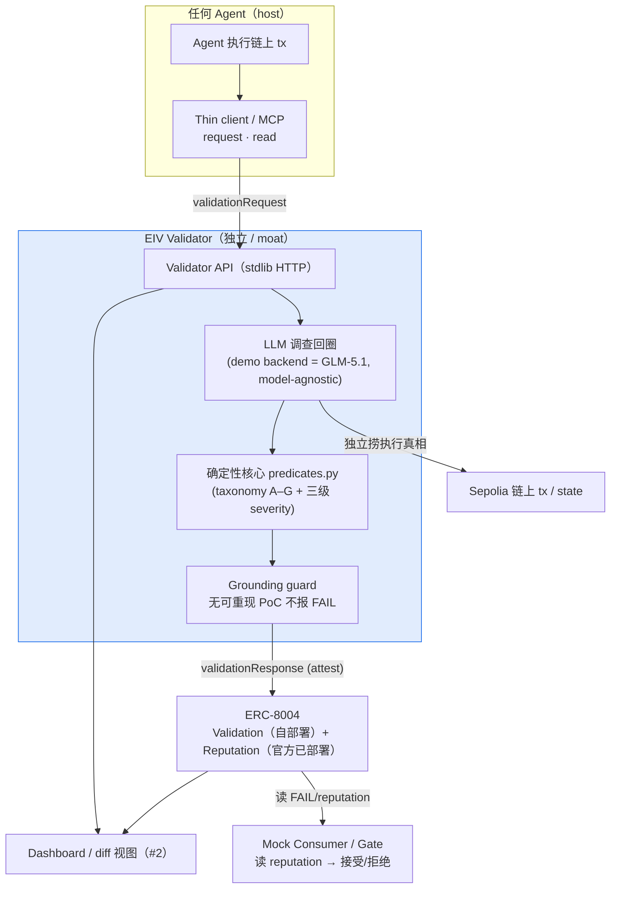

# EIV 快速入门指南

## 项目简介

EIV（Execution-Integrity Validator）是一个独立、事后验证 AI agent 链上执行完整性的基础设施。

**一句话**：检查「agent 的链上交易，有没有照它签章的授权 (intent) 执行」，把判定 attestation 进 ERC-8004，累积 reputation。

## 系统架构



## 快速开始

### 1. 运行 eiv-core

```bash
# 克隆仓库
git clone https://github.com/Monica06161127/eiv-core.git
cd eiv-core

# 端到端 demo：一份授权 × 三个执行 → PASS / FAIL / FAIL
python -m eiv.demo

# 自动化验收：23/23（in-process + 真 HTTP server）
python -m eiv.selftest

# 起 HTTP API（默认 127.0.0.1:8000）
python -m eiv.api --port 8000
```

### 2. 运行 eiv-dashboard

```bash
# 克隆仓库
git clone https://github.com/Monica06161127/eiv-dashboard.git
cd eiv-dashboard

# 方式 1：连接 eiv-core API（推荐）
# 终端 1：启动 eiv-core API
cd ../eiv-core
python -m eiv.api --port 8000

# 终端 2：打开 dashboard
cd ../eiv-dashboard
open index.html
# 或者用本地服务器
python -m http.server 3000
# 然后访问 http://localhost:3000

# 方式 2：Mock 模式（API 不在线时）
# 直接打开 index.html，点击「📂 加载 Mock 数据」按钮
```

### 3. 部署合约（可选）

```bash
# 克隆仓库
git clone https://github.com/Monica06161127/eiv-contracts.git
cd eiv-contracts

# 安装依赖
npm install

# 编译合约
npm run compile

# 部署到 Sepolia
cp .env.example .env
# 编辑 .env 文件，填写环境变量
npm run deploy:sepolia
```

## 团队分工

| 角色 | 主责 | 仓库 |
|------|------|------|
| **John**（技术 lead） | validator 核心 + 完整性逻辑 + chain adapter + ERC-8004 整合 / attestation + agent(LLM 调查)回圈 + 自部署 Validation Registry + 部署 | eiv-core, eiv-contracts |
| **Kieran**（技术 #2） | Dashboard / Demo UI(intent-vs-execution diff 的 money shot + mock consumer 拒绝画面)+ 共担整合 / 测试 | eiv-dashboard |
| **Luvia**（运营） | pitch + 3–5 分钟影片 + README / proposal + 提交 + 发布赛道推文 + Demo Day + 协调 | eiv-docs |

## Week 4 计划

### 6/8（一）
- **John**：起 `RpcChainAdapter` 骨架（接 Sepolia RPC）；确认 AIP `hashIntent` 可接；由 ERC-8004 ABI 写 Solidity interface
- **Kieran**：dashboard 起手：接 walking skeleton 冻结 schema，先用现有 fixture 纪录渲染 intent-vs-execution diff 骨架
- **Luvia**：pitch 大纲 + 影片脚本骨架；README 打磨清单；确认提交流程与素材

### 6/9（二）
- **John**：`RpcChainAdapter` 真解一笔 Sepolia tx → `ExecutionTrace`；最小脚本让玩具 agent 在 Sepolia 发「干净 swap」→ 真 tx hash
- **Kieran**：diff 视图填肉：PASS/FAIL 双态、violations 列表、金额字符串安全显示；对接 John 解出的真 trace
- **Luvia**：依 demo 流程草拟 pitch 叙事；收集截图素材

### 6/10（三）
- **John**：在 Sepolia 部署最小相容 **Validation Registry**；`OnChainAttestationSink` 真送 `validationResponse`；`EIP712Verifier` 换真验章 + ecrecover
- **Kieran**：dashboard 显示 attestation 区块；**mock consumer 视图**；共担 attest 路径测试
- **Luvia**：README 打磨；整理提交字段清单

### 6/11（四）
- **John**：source→adapter→validate→attest 串成真链端到端；接 **GLM-5.1** 调查回圈 + grounding guard
- **Kieran**：dashboard 端到端对接真数据；打磨 money shot；共担 end-to-end 测试
- **Luvia**：依端到端结果定稿 pitch；开始录影分镜

### 6/12（五）
- **John**：跑齐 2–3 场景；边界硬化；把 demo 跑顺给运营录
- **Kieran**：dashboard 定版 + 截图；与 John 对「demo 跑顺」彩排
- **Luvia**：录 3–5 分钟影片；README / proposal 定稿

### 6/13（六）
- **John**：上午最终端到端彩排、截图、诚实限制声明就位
- **Kieran**：上午 dashboard 最终检查、demo 录制支援
- **Luvia**：上午 README 最终检查、**执行提交**、**手动发布赛道推文**

## 详细文档

- [EIV-DOCS.md](EIV-DOCS.md) - 完整项目文档（v3）
- [DESIGN.md](../design/DESIGN.md) - 设计细节 archive